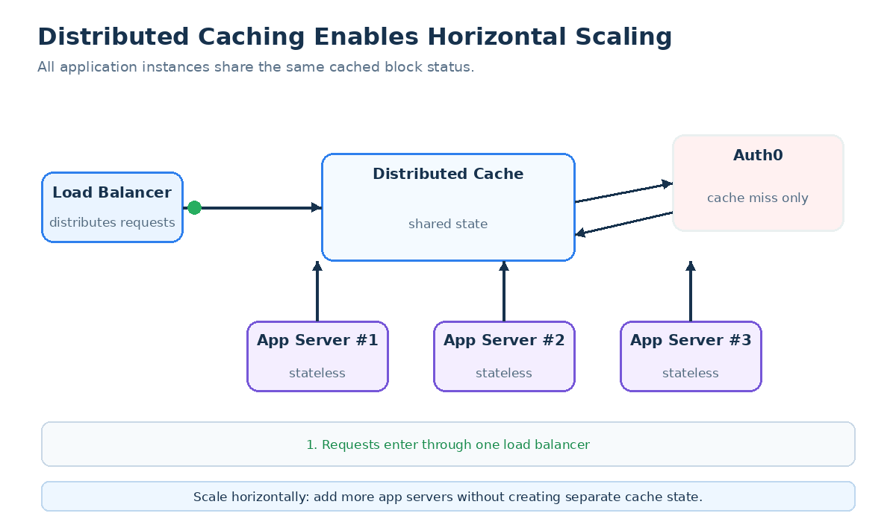
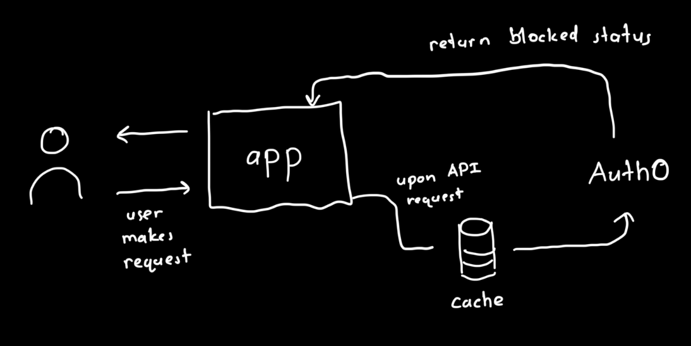

# 🔐 Auth0 Force-Logout Mechanism

> **A secure, cache-aware force-logout mechanism for web applications using Auth0.**

When a user is blocked, simply preventing their next login is not enough—the user may already have active sessions in the application.

This project addresses that problem by checking a user's blocked status during API requests, caching that status in a distributed cache, and immediately invalidating the user's active application sessions when they are detected as blocked. Future login attempts are also rejected.

---

## 📋 Table of Contents

* [Overview](#-overview)
* [Key Features](#-key-features)
* [Architecture](#-architecture)
* [Request Flow](#-request-flow)
* [Quickstart](#-quickstart)
* [Usage](#-usage)
* [Security Considerations](#-security-considerations)
* [FAQ](#-faq)
* [Future Improvements](#-future-improvements)
* [Resources](#-resources)

---

## 🎯 Overview

This project provides a high-level design for enforcing **force logout** in a web application integrated with Auth0.

The system has three primary goals:

1. **Detect blocked users** during normal API traffic.
2. **Terminate all active application sessions** for a blocked user.
3. **Prevent the user from logging in again** until they are unblocked.

A distributed cache sits between the web application and Auth0 so that the application does not need to query Auth0 on every API request.

### The core flow

```text
User
  │
  │ API request
  ▼
Web Application
  │
  │ Check cache
  ▼
Distributed Cache
  │
  ├── Cache hit ───────────────► Return block status
  │
  └── Cache miss / stale
             │
             ▼
           Auth0
             │
             ▼
       Store result + TTL
             │
             ▼
       Return block status
```

If the user is blocked:

```text
Blocked User
     │
     ▼
Web Application
     │
     ├──► Terminate all active application sessions
     │
     └──► Prevent future login attempts
```

---

## ✨ Key Features

### ⚡ Distributed block-status cache

The application first checks a shared distributed cache rather than querying Auth0 for every request.

This reduces:

* Auth0 API traffic
* Request latency
* Dependency on Auth0 availability
* Repeated lookups across application instances

Cached entries use a **TTL**, allowing the system to balance performance against how quickly newly blocked users are detected.

---

### 🔒 Force logout

When a blocked user is detected, the application invalidates **all active sessions belonging to that user**.

This is intentionally an application-level operation:

```text
Blocked user detected
        │
        ▼
Invalidate user's sessions
        │
        ▼
Existing sessions can no longer access the application
```

---

### 🚫 Prevent future logins

Session invalidation alone is insufficient because the user could simply authenticate again.

The application therefore also enforces the blocked state during authentication:

```text
Login attempt
     │
     ▼
Is user blocked?
   /       \
 Yes       No
  │         │
Reject     Login
```

---

### 🌐 Horizontally scalable

Because block-status information is stored in a distributed cache, multiple application instances can share the same state:

<!-- 
```text
                ┌──────────────┐
                │ Distributed  │
                │    Cache     │
                └──────┬───────┘
                       │
          ┌────────────┼────────────┐
          ▼            ▼            ▼
      App Server    App Server    App Server
          │            │            │
          └────────────┴────────────┘
```
-->


---

## 🏗️ Architecture

The following diagram shows the complete force-logout flow.



### Components

**User**

The client making authenticated requests and attempting to log in.

**Web Application**

The application's backend. It performs the block-status check and owns application session invalidation.

**Distributed Cache**

A shared cache such as Redis or Memcached containing the user's block status.

**Auth0**

The external identity provider and source of the user's authentication/block status.

**Application Session Store**

The application's session-management layer. When a user is blocked, all sessions associated with that user are invalidated.

---

## 🔄 Request Flow

### 1. User makes an API request

The request reaches the web application with the user's authentication credentials/access token.

### 2. Application checks the distributed cache

The application looks up the user's block status.

### 3. Cache hit

If the cached value is still valid, the application can immediately determine whether the user is blocked.

### 4. Cache miss or stale entry

The application queries Auth0 for the current status and stores the result in the distributed cache with a TTL.

### 5. User is not blocked

The request continues normally.

### 6. User is blocked

The application:

1. Invalidates all active sessions for the user.
2. Rejects the current request.
3. Marks/enforces the user as blocked for future authentication attempts.
4. Returns an appropriate authentication/authorization response to the client.

### 7. Future login attempt

If the same user attempts to authenticate again, the login flow checks the blocked state and rejects the login.

---

## 🚀 Quickstart

### Prerequisites

Depending on the implementation, you will need:

* An Auth0 tenant
* An Auth0 application configured for the web application
* A distributed cache such as Redis
* A running instance of the web application
* Access to the application's session store

### 1. Clone the repository

```bash
git clone <REPOSITORY_URL>
cd <REPOSITORY_NAME>
```

### 2. Configure environment variables

Create a `.env` file:

```env
AUTH0_DOMAIN=<your-auth0-domain>
AUTH0_CLIENT_ID=<your-client-id>
AUTH0_CLIENT_SECRET=<your-client-secret>

REDIS_URL=<your-redis-url>

SESSION_TTL=<your-session-ttl>
BLOCK_STATUS_TTL=<your-block-status-ttl>
```

> **Never commit credentials or secrets to source control.**

### 3. Start the distributed cache

For a local Redis instance:

```bash
docker run --name force-logout-redis \
  -p 6379:6379 \
  -d redis
```

### 4. Start the application

```bash
<INSTALL_COMMAND>
<START_COMMAND>
```

### 5. Verify the flow

Make an authenticated API request:

```bash
curl \
  -H "Authorization: Bearer <ACCESS_TOKEN>" \
  http://localhost:<PORT>/api/example
```

The application should:

```text
API request
    ↓
Cache lookup
    ↓
Auth0 lookup if necessary
    ↓
Block status
    ↓
┌───────────────┬────────────────┐
│ Not blocked   │ Blocked        │
│       ↓       │       ↓        │
│ Normal flow   │ Force logout   │
│               │ + reject login │
└───────────────┴────────────────┘
```

---

## 💻 Usage

### Normal user

A user who is not blocked follows the normal request path:

```text
Client
  │
  │ GET /api/resource
  ▼
Web Application
  │
  │ Check block status
  ▼
Cache
  │
  │ Not blocked
  ▼
Process request
  │
  ▼
200 OK
```

### Blocked user

A blocked user follows the force-logout path:

```text
Client
  │
  │ GET /api/resource
  ▼
Web Application
  │
  │ Check block status
  ▼
Cache / Auth0
  │
  │ BLOCKED
  ▼
Invalidate all application sessions
  │
  ▼
Reject request
  │
  ▼
401 / 403
```

The user's next login attempt is also rejected.

---

<!--

## 🎥 Demonstrations

### Force logout


> Demonstrates a user being detected as blocked and having their active application session terminated.

### Login prevention


> Demonstrates a previously blocked user attempting to log in again and being rejected.

**under construction**

-->

---

## 🔐 Security Considerations

### Cache TTL

The cache introduces a deliberate tradeoff.

A longer TTL:

* Reduces Auth0 traffic
* Improves performance
* Increases the potential delay before a newly blocked user is detected

A shorter TTL:

* Detects block-status changes faster
* Increases Auth0/cache traffic

The appropriate TTL should therefore be selected based on the application's security requirements.

### Session invalidation

The application must invalidate **every active session associated with the blocked user**, rather than only the session that triggered detection.

### Race conditions

The system should account for requests that are already in flight when a user becomes blocked.

A request that began before the block decision may already be executing while another request detects the block.

### Cache consistency

Because multiple application instances share the cache, the cache must provide consistent enough behavior for the application's security requirements.

The system should also define what happens when the cache or Auth0 is unavailable.

---

## ❓ FAQ

### Does every API request call Auth0?

**No.**

The application first checks the distributed cache. Auth0 is queried when the cached value is missing or stale.

---

### What happens to a user's existing sessions?

All active **application sessions belonging to the blocked user are invalidated**.

The user is then effectively logged out of the application.

---

### Why isn't invalidating the Auth0 session enough?

The application may maintain its own sessions or session state after authentication.

Therefore, the application must explicitly invalidate its own sessions when the user is blocked.

---

### Can the user simply log in again?

Not if the blocked state is still enforced.

The authentication flow must reject login attempts from users who are blocked.

---

### What happens if the cache is unavailable?

This should be explicitly defined as part of the application's failure policy.

For security-sensitive applications, a conservative policy may reject requests when the block status cannot be reliably determined. Other applications may use a bounded fallback strategy.

---

### How quickly does a block take effect?

It depends primarily on the cache TTL and the application's request traffic.

A shorter TTL provides faster detection of changes in Auth0 at the cost of additional lookups.


## 🔮 Future Improvements

Potential extensions include:

* Event-driven block-status propagation instead of relying primarily on TTL-based polling
* More granular session invalidation
* Metrics for blocked-user detection latency
* Monitoring for cache misses and Auth0 failures
* Circuit-breaking around Auth0
* Audit logging for force-logout events
* Administrative tooling for blocking/unblocking users
* Automated integration tests covering concurrent requests and session invalidation

---

## 📚 Resources

* [Auth0 Documentation](https://auth0.com/docs/)
* [Redis Documentation](https://redis.io/docs/)

---
